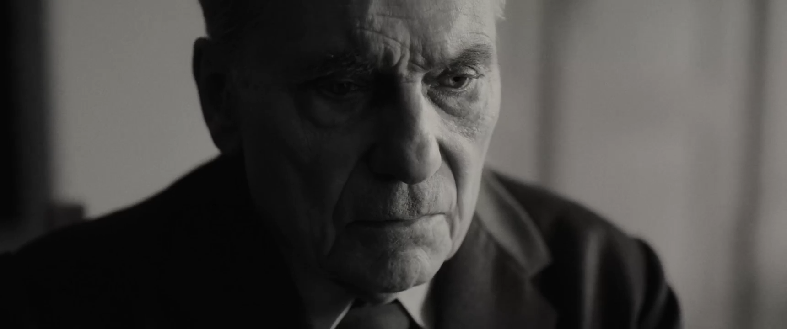
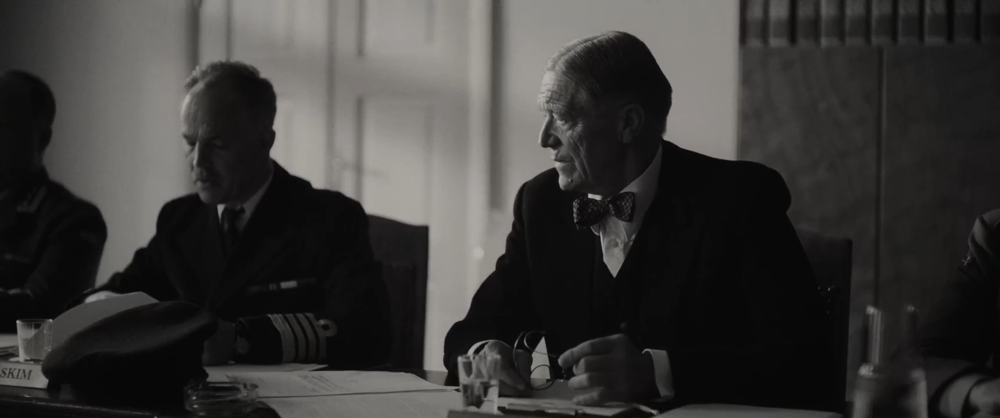
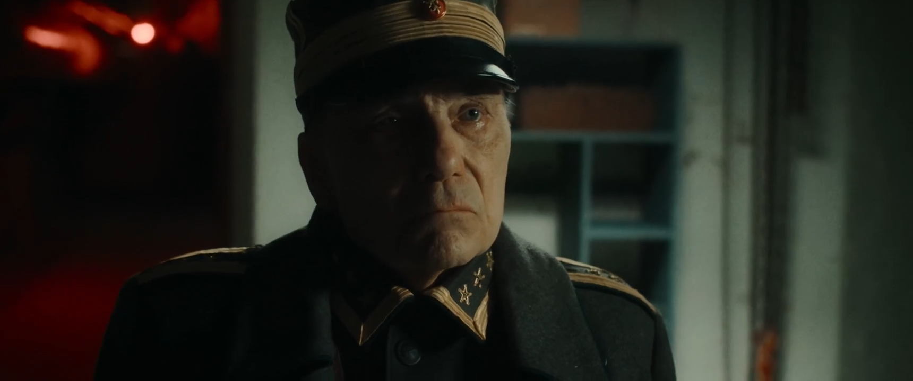
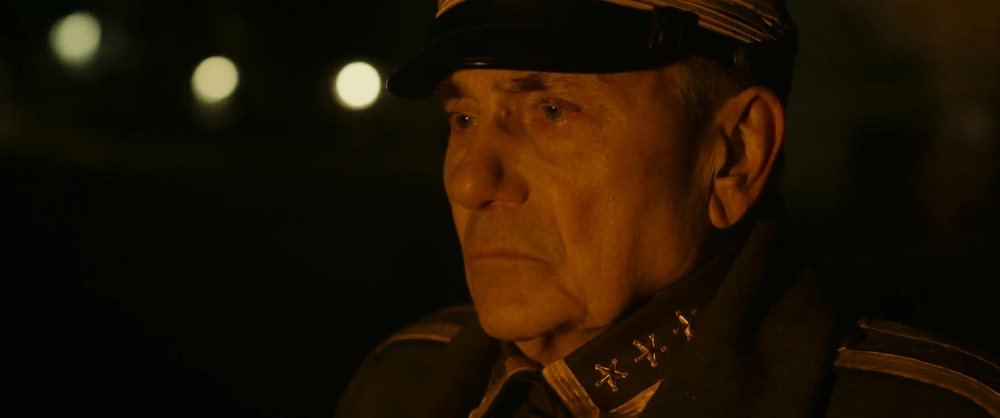
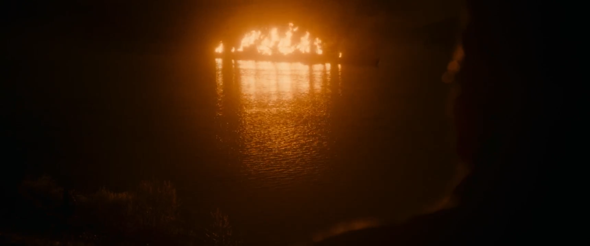
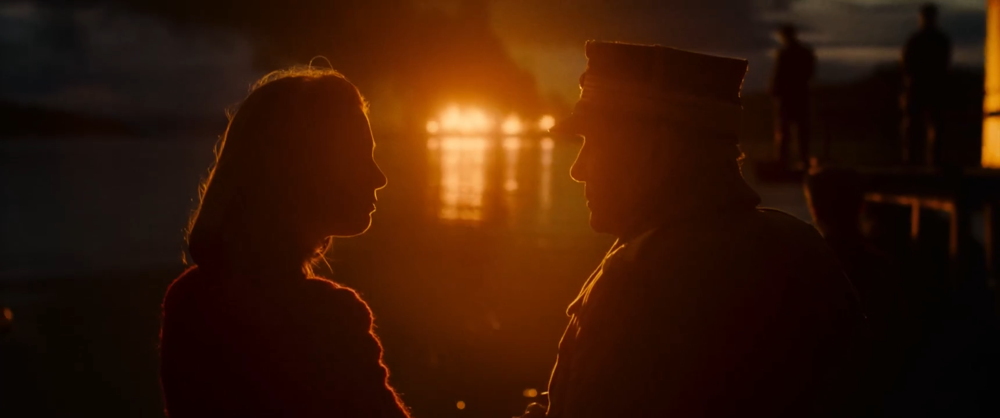
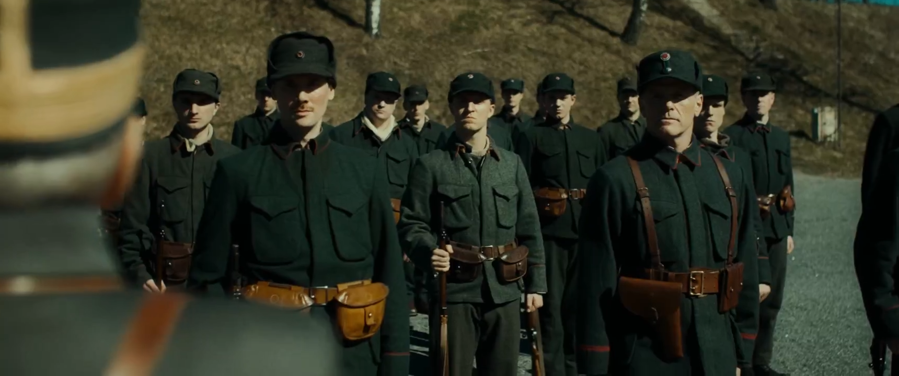
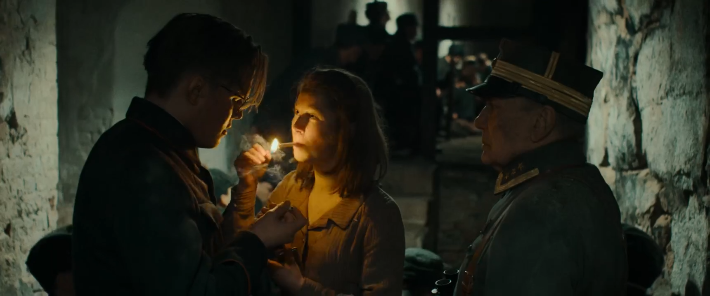
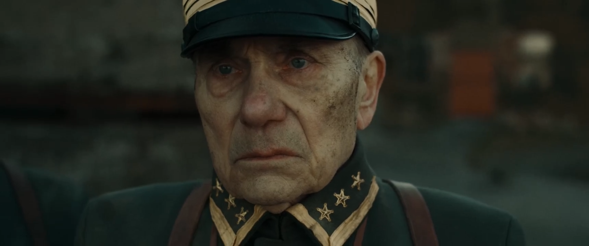
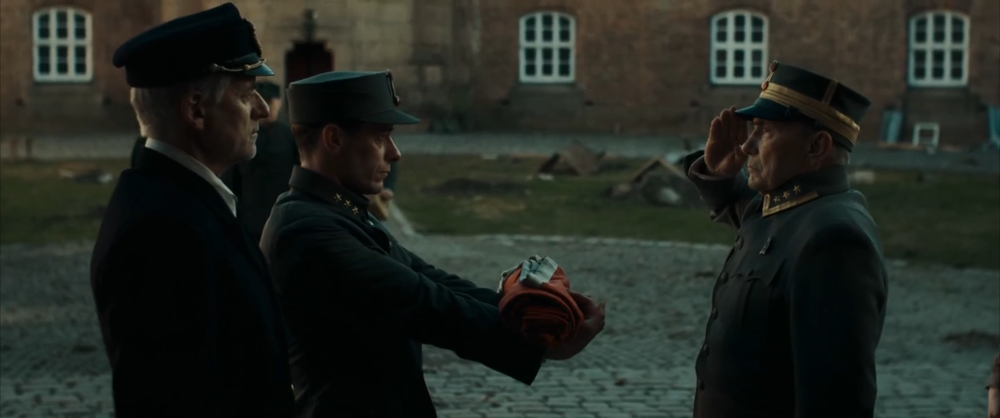

# 前語

*Blücher* 這個名字我更熟悉的其實是拿破崙戰爭時期的普魯士將軍(下方左圖)，但在這裡指的二戰德國撕毀《凡爾賽條約》條約後建造的希佩爾海軍上將級重巡洋艦的二號艦。

  
  

這部是今天在趁強化學習模型在訓練的時候，一邊吃骰子豬+義大利麵一邊看的電影。一開始聽還以為是德語，例如「是」、「不是」、「謝謝」都很像，搜尋之後才知道是挪威語XD

其實對這段歷史不怎麼熟悉，我反而對挪威不遠的芬蘭在二戰中的表現比較有印象，但這部一樣是聚焦在弱國如何與強國相抗，以及很常看到的一種現象，人們總是在太平之時反過頭來審判當時臨危受命的戰爭英雄，也就是這部的主角──比格爾·埃里克森。

後來查到也有一部 *The King's choice* 也是相同背景。

# 背景
這部主要是描述1940年4月9日德軍「[威悉演習行動](https://zh.wikipedia.org/zh-tw/%E5%A8%81%E6%82%89%E6%BC%94%E4%B9%A0%E8%A1%8C%E5%8A%A8)」期間，挪威 Oscarsborg Fortress 守軍在布呂歇爾號與其隨艦侵入時的艱難抉擇，主角六旬上校比格爾·埃里克森決定開炮並擊沉該艦，為挪威爭取備戰時間的經典歷史事件。

參見[德勒巴克灣海戰](https://zh.wikipedia.org/zh-tw/%E5%BE%B7%E5%8B%92%E5%B7%B4%E5%85%8B%E7%81%A3%E6%B5%B7%E6%88%B0)。

# 觀後感
電影的敘事手法是主角在戰後軍事審判與當時戰時的回憶交錯進行。

有趣的地方是，戰時的回憶是彩色的，而軍事審判的部分則是黑白的，這種對比蠻反諷的，埃里克森表現出一種「好累，我要怎麼跟你們這些白癡解釋」的無奈感。

以及委員會，他們穿著整潔的西裝，對主角的行為進行審判，從前面的「你當時收到了什麼命令」，到後面的「你是否過早投降」，都顯現出他們的傲慢。

我很喜歡這部文戲的鋪陳，主角其實再半年就退休，而之前向高層遞交的關於要塞加強的申請書不斷被駁回，其實也已經有點灰心了。但他在高層指令模糊、要扛住沒有動員令的這個大旗的壓力下，讓士兵們上崗。問題相當多，例如岸邊炮、魚雷武器都老舊，將官沒經驗、甚至人手不足，還要將傳令兵、廚師等非戰鬥人員整編至砲兵團才勉強讓整個要塞武裝起來。

最有印象的這句:
*Norway has not been at war for over 120 years!*

以及因為當時挪威是中立國，所以高層、部下不斷認為不該開炮在情報一直未指出那些軍艦的國籍時，主角說的:
*Aren't they then the attacking party?*

布呂歇爾號被擊沉後，主角神色凝重看著遠處在大火燃燒的軍艦與聽見德國人的哀號聲，這時才知道是德國主動進攻，此時埃里克森的女兒說:「我們應該幫助他們」，但埃里克森拉住了她的手，那個眼神真的沉重，或許是在想未來還會遭遇到什麼，或許是對戰爭的厭惡，但又無可避免必須反擊。

在這裡已經聞到反戰的味道了。

大火瀰漫的布呂歇爾號:

整部裡面，我覺得最漂亮的畫面:

接著第二天一早，才得知大部分挪威重要城市都已淪陷，埃里克森收到上級的命令，盡可能長期死守。於是開始召集新兵，給每個人發槍，在準備發表演說的時候，馬上遭到德國空軍的轟炸，只得狼狽逃回，不過我嚴重懷疑他們根本沒AA，只有空襲警報而已......。

因為空襲，所以大家只能躲進去防空洞，遇到了之前在炮擊布呂歇爾號時受傷的新兵，在地下防空洞因為被炸彈轟炸，燈光時暗時明，以及與外界斷聯的窒息壓力下，那個新兵說:「我們應該舉白旗出去，不能待在這裡」，最後還是在主角跟其女兒的安撫下，才冷靜下來，我覺得這個畫面蠻有意思的:

或許在這個時候，埃里克森有所動搖了吧，歸根究柢他更不想要有人因戰爭而死。

大家一直都是 Wait-and-see，直到真正出事。

等空襲暫緩後，埃里克森出去視察，被昨晚成功逃離的 Lützow 號所發射的砲彈給震倒，鏡頭又回到審判現場，委員會問，為何當時前晚不繼續砲擊?埃里克森說他不想追擊逃跑的敵人，甚至是大家已經沒有能力了。

接著埃里克森到魚雷陣地，空襲再次襲來，對岸的挪威砲兵陣地在空襲造成的混亂時被德軍拿下，此時埃里克森才真正想投降，因為那個陣地隨時都可以調轉砲頭打向要塞。而委員會卻覺得這是埃里克森的判斷失誤，不該向陣地下達「等待下一步指示」的命令，應該繼續砲擊 Lützow 號，而埃里克森擔心的是，一旦砲兵陣地開火，便會成為所有戰艦的眾矢之的。

幸好最後的投降是有尊嚴的。

當敵人都對你表達無上的敬意時，為何你死命護在身後的人竟敢有臉問責你的不是呢?

飾演埃里克森的演員真的將那股開戰前的生死抉擇、國家存亡的掙扎以及被問罪的悲憤都演在臉上了。

# 評價
我認為節奏控制地蠻好的，看完就是有種胸悶感，更是無盡的情感克制，更深深體會到無能的政府對有能之人的枉費。

換你來思考，為何這部片要以入侵者的船艦為名，而非要塞之名呢?

還有相比起來法國實在太遜啦XD

  <iframe
    width="100%"
    height="400"
    src="https://www.youtube.com/embed/ccz0EXDYg9E"
    title="YouTube video player"
    frameborder="0"
    allow="accelerometer; autoplay; clipboard-write; encrypted-media; gyroscope; picture-in-picture; web-share"
    allowfullscreen
  ></iframe>

