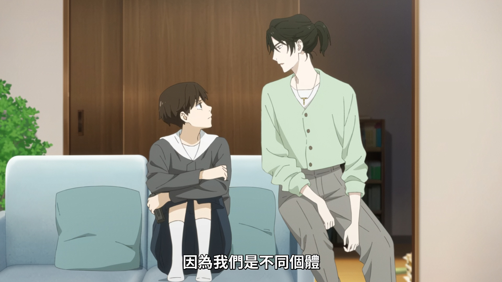
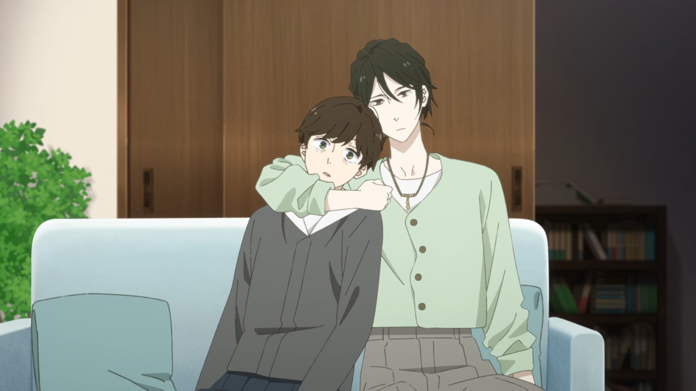
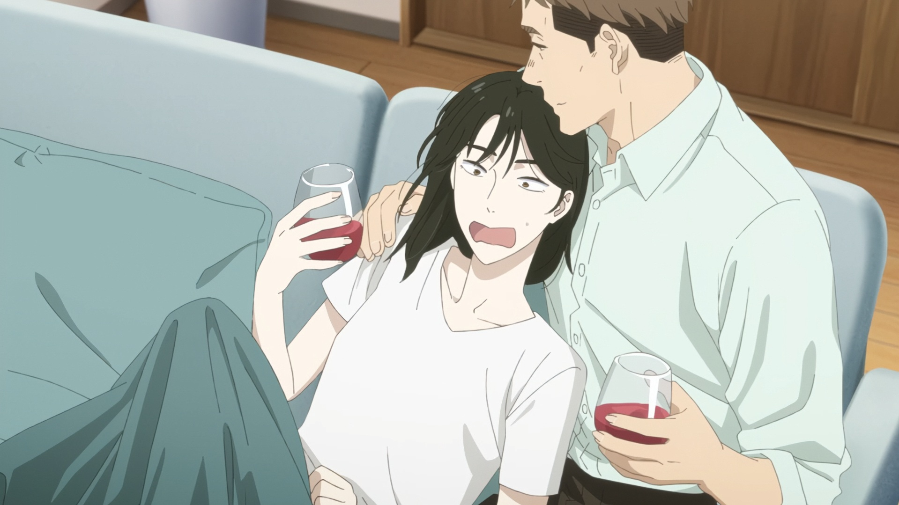
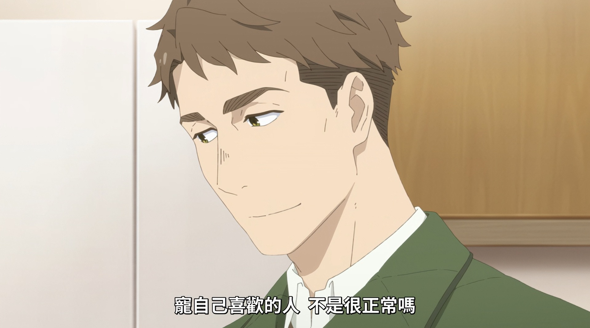

# 隨筆
這部雖然節奏很慢，但是我認為每一回都是神回耶，一開始以為只是描寫田汲朝與她阿姨高代槙生的相處日常，後來發現這是一部群像劇，每個人都有自己的課題。

挑選裡面幾個截圖，都是我很喜歡的畫面: 

朝跟槙生的相處，畢竟槙生永遠不可能成為朝的母親，但她又是朝唯一的親人了，微妙的孤獨感。

超可愛的。

槙生跟她的前男友兼「朋友」笠町信吾，對我來說，他們就是我理想中「大人的戀愛」，即使分手了，還是朋友，會互相關心，而且能坦率直白地講出自己內心的話，超可愛的。

還有這種直球對決的告白。

這部我還有很多喜歡的地方，但因為太好看了，所以很多片段我都忘記截圖，例如槙生不知道該跟朝說什麼的時候，就會說「那我們來吃飯吧」，以及槙生們的好朋友，都是知心的朋友。朝的朋友也是。其實有好多課題都很貼近現實，像是醫科大學故意將女生的分數調低、親人之間的相處、朋友之間的相處、男性困境、戀愛關係等等，都是很真實的描寫，好哭又好看。

很久沒看到文戲如此充沛又細膩的作品了，期許我自己也能勾勒出如此立體的故事。

也期許自己有面對未來的勇氣，希望能像朝一樣，走出失去親人的陰影，認真思考自己想要成為怎樣的人。

因為槙生是小說家嘛，也是感同身受啦(X)

最後來聽聽 ED 吧：

  <iframe
    width="100%"
    height="400"
    src="https://www.youtube.com/embed/rTCruzbXBWY"
    title="YouTube video player"
    frameborder="0"
    allow="accelerometer; autoplay; clipboard-write; encrypted-media; gyroscope; picture-in-picture; web-share"
    allowfullscreen
  ></iframe>

