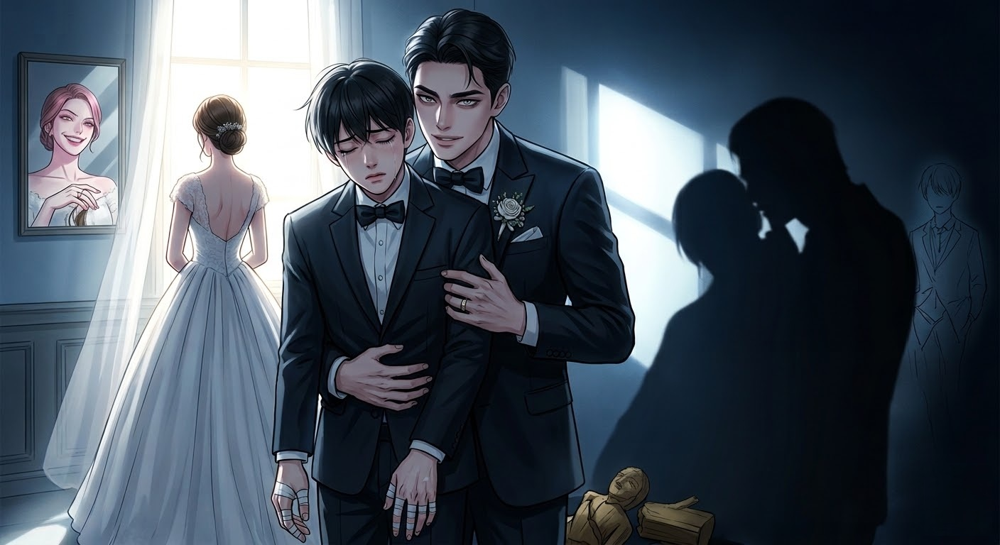

# 三十四：太陽的陰影

你明明是先認識我的。

你還記得你當年是怎麼追我的嗎？那個你熬了三個通宵、手指貼滿透氣膠帶才刻出來的笨拙木雕；那家你連吃了整整一個月泡麵，才敢請我去的頂樓星空餐廳。你那天穿著不合身的襯衫，緊張得連刀叉都拿不穩，結巴著對我說：「我、我一定會對妳好……」

柏恩，你真的好深情。深情得像個笑話。

你永遠不會知道，那天晚餐後，我一坐進菲齊的車裡，我們兩個人笑得有多開心。菲齊把你送我的那個木雕隨手扔進了後座的垃圾箱，一邊吻我一邊笑著說：「妳看他剛才那副蠢樣，好可憐的哥布林。」

伴郎的西裝也是租來的吧？肩膀那裡明顯不合身。

婚禮現場的聚光燈打在我們身上。我站在台上，由上而下地看著站在陰影裡的你。菲齊溫柔地為我戴上戒指時，台下爆發出雷鳴般的掌聲。而我的餘光卻一直停留在你身上。

你看著我們，舉起香檳，杯口磕到牙齒，發出微弱的脆響。這點細微的失態，我在台上看得一清二楚。

你強迫自己跟著眾人一起笑。你笑得顴骨發酸，你用最真誠的聲音對我們說：「祝你們幸福，菲齊，好好照顧她。」

柏恩，你知道嗎？在那一秒鐘，你看著我們的那種心碎、嫉妒、卻又不得不裝作大度的屈辱眼神……簡直美得讓人移不開眼睛。

---

伴郎的西裝是我租來的，肩膀處有些不合身，領結勒得我幾乎喘不過氣。

婚禮現場的燈光很暗，聚光燈打在舞台中央。我站在陰影裡，看著菲齊低下頭，溫柔地為她戴上戒指。台下爆發出雷鳴般的掌聲。大螢幕上正在播放他們的交往回憶錄，其中有一張合照——那是三年前，我第一次把那個笑起來有梨渦的女孩，以「我喜歡的女生」的身份，介紹給自己好兄弟的那天。

我舉起香檳，杯口磕到牙齒，發出微弱的脆響。

我強迫自己跟著眾人一起笑。臉頰的肌肉不受控制地微微抽搐。我聽見自己用最誠懇、最溫柔的聲音對他們說：「祝你們幸福，菲齊，好好照顧她。」

菲齊緊緊地擁抱了我，眼眶泛紅地說：「謝謝你，柏恩，沒有你，就沒有我們。」

我拍著他的背。但只有我自己知道，在那一秒鐘，我多希望頭頂那盞巨大的水晶吊燈直接砸下來，把這一切耀眼的光芒全部砸碎。

敬完酒去洗手間的那一刻，看著鏡子裡那個虛偽的自己，覺得自己就像個可悲的跳樑小丑，我竟然要裝著大氣，笑著對他祝福。

我是個怪物。我清楚地知道這一點。這份扭曲的惡意，到底是從什麼時候開始生根的？ #Edit 愛意/惡意

或許是那個深夜，我獨自留在工作室。我從菲齊座位旁的垃圾桶裡，撿起了他隨手揉成一團丟掉的廢稿。我將那張皺巴巴的紙攤平在桌上，看著上面流暢的線條與驚人的空間結構。

我盯著那張廢稿看了整整兩個小時。然後，我默默轉過頭，看著自己電腦螢幕上那份修改了四十七次、熬了無數個通宵的最終設計圖……我突然覺得自己就像一個毫無才華的笑話。

菲齊隨手撇了兩筆的草圖，能讓嚴苛的教授驚嘆連連；而我嘔心瀝血、修改了無數次的圖紙，卻只換來一句「匠氣太重」。

明明是我先接觸設計的。明明是我教他怎麼使用軟體的。

為什麼天賦這種東西，可以這麼殘忍？

明明國中時我被全班排擠，是他抱著我、牽起我的手說「我會一直陪著你」，甚至還親了我。

明明是我先認識她的，為什麼她最後不是選擇我呢？

明明每次都是我先，為什麼你總能輕易得到？

但菲齊從來沒有做錯過任何事。他越是純粹地感激我，我就越覺得自己那種「寧願得獎的是陌生人也不要是他」的嫉妒心，醜陋得令人作嘔。

我根本沒有資格恨他。

但榜單公佈的那一秒，我胃裡像吞了一把碎玻璃。我只能死死盯著螢幕上他的名字，滑鼠邊緣被我的指甲摳出了白痕。我必須非常用力地咬住口腔內側的軟肉，用血腥味來壓抑住自己想要大叫的衝動。

他的耀眼，顯得我是個廢物。

凌晨三點，我坐在散發著泡麵酸味的租屋處，雙眼布滿血絲。我用顫抖的手指敲擊著鍵盤，把我最清楚的那些、菲齊平時用來做風格參考的草圖，斷章取義地捏造成了抄襲的鐵證。

我寫下了一封極具毀滅性的匿名黑函。

滑鼠懸停在發送排程上。我設定了：明天中午十二點，定時發送給全體業界媒體與評審委員會。

按下「確認」的那一瞬間，我的胃裡一陣翻江倒海，我衝進廁所，對著馬桶瘋狂地乾嘔。我恨他輕易奪走了一切，但我更恨這個被嫉妒吞噬到面目全非的自己。

我喜歡的是你？還是妳？

然後，我渾渾噩噩地走出門，在過馬路時，被一輛失控的貨車當場撞碎。

---

「求求你們！救救他……也救救我這個垃圾吧！」

三個小時前，彼岸物流，送別組辦公室。

巨大的轉播螢幕上，正在播放凡間的設計大賞頒獎典禮。文質彬彬、西裝筆挺的菲齊站在台上，眼眶通紅，手裡緊緊握著那座象徵業界巔峰的獎盃。

「這個獎，我不能一個人獨享。」螢幕裡的菲齊聲音哽咽，「我要把它獻給我最好的兄弟，柏恩。沒有他當初帶我進這個領域，沒有他這幾年來不斷包容我、鼓勵我，我絕對走不到今天。柏恩……謝謝你。」

螢幕外，柏恩跪在冰冷的地板上，哭得撕心裂肺。

他死死抓著瑞內的褲管，指甲幾乎要嵌進瑞內的小腿裡。充滿了靈魂即將崩潰的絕望與極度的自我厭惡。

「我是個怪物……我是一個見不得別人好的垃圾！」柏恩的臉因為懊悔而扭曲著，「我寫了黑函！我設定了今天中午十二點發送！求求你們去我的電腦裡取消它！我嫉妒他，我甚至恨他為什麼能輕易拿走我想要的一切……但我不想毀了他！我真的不想毀了他啊！！」

瑞內低頭看著這個哭到靈魂都在發抖的年輕人，心裡泛起一陣難以言喻的酸楚。

「好無聊。活著的時候不敢當面說，死了才來後悔？」艾利靠在辦公桌旁，雙臂環抱，眼神冷漠地看著柏恩，但他的目光卻時不時地瞥向一旁神情黯然的瑞內。

由於多盧斯剛剛把這堆積壓的「特殊委託」塞給了送別組，瑞內和艾利別無選擇，只能帶著遠端連線的柔伊，緊急前往凡間拆除這顆名為「嫉妒」的定時炸彈。

---

「距離郵件發送，還有最後四分鐘！到底行不行啊？！」

「不過最扯的還是他自己竟然把密碼給忘記了，果然被車撞到腦子都壞了！」

凡間，正午 11:56。柏恩那間狹小、散發著泡麵酸味與霉味的租屋處裡，柔伊焦躁的聲音在通訊耳機裡炸開。

瑞內和艾利正隱身站在柏恩的電腦螢幕前。螢幕上顯示著一個鎖碼的郵件發送排程軟體，紅色的倒數計時器正無情地跳動著。

「別催啦！」柔伊在那頭瘋狂敲擊鍵盤，「強制破解會觸發自動發送機制，直接寄給所有人！」

「密碼？」艾利冷笑了一聲，「他死前恨那個叫菲齊的傢伙恨得要命，密碼肯定是『菲齊去死』之類的。人類的惡意不就這點創意嗎？所以是8774？」

「……是對自己的恨，也是嫉妒……」

瑞內雙手撐在桌面上，死死盯著那個密碼輸入框。他的目光掃過凌亂的桌面，最終停在了螢幕角落。

那裡用相框小心翼翼地壓著一張已經泛黃的舊照片。照片裡是大學時期的柏恩和菲齊，兩人都穿著廉價的系服，手裡共同捧著一個粗糙的小獎盃，笑得像兩個傻子。那時的柏恩，笑容裡還沒有任何陰霾。

瑞內深吸了一口氣。如果嫉妒的盡頭是無法原諒自己的悔恨，那麼鎖住這份惡意的密碼，一定是這個自卑的靈魂，心底最捨不得觸碰的光。

「他最想要的，從來都不是毀了菲齊。」瑞內輕聲說道，彷彿在說給那個已經在彼岸哭到崩潰的靈魂聽，「他只是……太懷念當年那個還能真心替兄弟高興的自己了。」

瑞內的手指放到了鍵盤上，敲下了照片底部的那個日期：202814。

「喀噠。」

清脆的解鎖聲響起。紅色的倒數計時器在 11:59 瞬間停止，那封充滿惡意與謊言的黑函，被瑞內毫不猶豫地拖進了資源回收桶，徹底粉碎。

房間裡安靜了下來。只有主機風扇微微轉動的聲音。

通訊器裡傳來了柔伊如釋重負的聲音：「喔哇，大廳這邊，柏恩的靈魂已經平靜下來了。他最後一句話，是請我們代他向菲齊和那個女孩說聲對不起。」

瑞內長長吐出一口氣，看著那張泛黃的照片：「站在太陽旁邊……連自己的影子都會覺得特別扭曲吧。」

艾利難得沒有出言嘲諷，只是看著瑞內的側臉，陷入了沉默。他們以為，自己完成了一場偉大的救贖——保住了菲齊的事業，也保住了柏恩靈魂最後的純潔。

直到時間來到 12:05。

房間的門把，突然被人轉動了。

瑞內和艾利立刻躲入衣櫥內，退到房間的陰影角落。

走進來的人，是剛在樓下辦完法會、穿著一身黑色喪服的菲齊。

菲齊反手鎖上了房門。在聽到鎖舌「喀」一聲落下的瞬間，他臉上那副在人前痛不欲生、雙眼紅腫的悲傷表情，就像是被一塊海綿瞬間抹去了一樣，消失得無影無蹤。

取而代之的，是一種扭曲、帶著狂熱的迷戀。

他走到柏恩的床邊，深深吸了一口氣，然後拿起柏恩生前常穿的那件舊外套，近乎病態地將臉埋了進去，深深地嗅著。

「伯恩，我真的好喜歡你依賴我的樣子，好喜歡你哭的樣子，但再也看不到了。」

「哇靠，他在幹嘛……伊金變態。」瑞內覺得胃裡一陣翻騰。

緊接著，門被輕輕敲了兩下。

菲齊走過去開門。進來的，是胸前別著白花的新婚妻子——那個柏恩暗戀了七年、死前都覺得自己配不上的女孩。

女孩走進房間，看著菲齊手裡的外套，不但沒有恐懼，嘴角反而勾起了一抹嬌媚的微笑。她從背後輕輕環抱住菲齊，下巴抵在他的肩膀上，目光落在書桌上柏恩的遺照。

「他今天被車撞的時候，表情痛苦嗎？」女孩輕聲問道，語氣裡竟然帶著一絲病態的興奮。

「很痛苦。我認屍的時候看到了，眉頭皺得很緊，整個人都被撞碎了呢。」菲齊握住女孩的手，兩人相視一笑，彷彿在討論一件剛入手的完美藝術品。

此時，耳機裡傳來柔伊徹底失控、甚至帶著恐懼的聲音：「瑞內、艾利……快看資料！這對夫妻根本是徹頭徹尾的瘋子！他們的手機連上了這裡的 Wi-Fi，我剛掃描了他們的通訊紀錄……」

瑞內和艾利的視網膜上，跳出了女孩在婚禮當晚寫下的那篇《觀察日記》，以及他們夫妻倆的一些通訊紀錄：

【年份：2022年 / 對話紀錄 - 收件人：阿彪】

菲齊：明天我會給你錢。明天體育課，叫你的人再把柏恩的衣服丟進垃圾桶一次。再逼緊一點，讓他知道，這世界上除了我以外，沒有人會理他。

【年份：2028年 / Instrgam 對話】

女孩：今天他又傳訊息祝我晚安了。他永遠是個舔狗，超好笑，他真的很會自我感動耶。

菲齊：把他留在身邊，當一個永遠仰望我們的陪襯，看他為我們痛苦，我創作需要很多想法，他就是最棒的靈感來源啊。

【年份：2035年 / Google Keep】

菲齊：柏恩死了。但我一點都不難過。因為死亡才是最完美的防腐劑。他永遠不會發現真相了，他會永遠帶著對我的崇拜與那點可笑的愧疚感死去。他現在，完完全全、永遠只屬於我一個人了。

看完這些資料，瑞內整個人如墜冰窟。胃裡一陣翻江倒海，幾乎要嘔吐出來。

柏恩連受害者的尊嚴都沒有——他從頭到尾，只是這對病態夫妻用來增添生活情趣的玩具！柏恩死前心心念念、拼了命想要取消的那封黑函，根本就是個笑話！

而自己，親手把柏恩最後的、也是唯一一次的反擊，扔進了資源回收桶。

就在瑞內雙眼通紅，幾乎要失去理智衝出衣櫃時，房間裡的女孩鬆開了菲齊。

她踩著高跟鞋，慢慢走到柏恩那張凌亂、單薄的單人床邊。她伸出戴著婚戒的手指，輕輕撫過柏恩睡過的枕頭，上面還有柏恩留下的髮絲。

然後，她轉過頭，看著菲齊，臉頰泛起一絲病態的潮紅。她嬌笑著，吐出了一句讓瑞內瞬間血液冰涼的話：

「親愛的，為了慶祝他終於完完全全、永遠只屬於我們了……我們在柏恩的床上做吧。」

「當然好，但我要想著伯恩。」菲齊笑著解開了喪服的領帶，將柏恩的那件舊外套墊在了床鋪中央。

「好可惡！！」

瑞內發出了一聲崩潰的低吼，手已經摸到了腰間的鑰匙。但下一秒，一隻冰冷的手死死捂住了他的嘴，另一隻手將他狠狠按著。

是艾利。

艾利的臉色比紙還要蒼白。他那雙看過千百年血肉橫飛的眼眸裡，此刻竟然充滿了難以名狀的震驚與戰慄。

這個活了千年的天使，見過無數的殺戮與戰爭。但這種將一個人的尊嚴、愛意、靈魂，一點一滴剝皮拆骨、當成玩物般褻瀆的純粹惡意，卻讓他感到了一陣生理性的作嘔。

更讓他恐懼的是，菲齊那種「為了把你永遠留在我身邊，所以我為你編織一個完美的牢籠」的極端愛意，像是一把生鏽的尖刀，精準地捅進了艾利靈魂的最深處。

他是不是也曾在無意間，展現出這種令人窒息的控制慾？

「沒用的……」艾利在瑞內耳邊用極微弱的聲音說道，聲音沙啞得彷彿撕裂了一般，「柏恩已經喝下孟婆湯了。你現在出去……只會讓他連轉世的機會都沒有。」

瑞內死死咬著牙，他看著衣櫃門縫外，桌上的那張伯恩遺照，眼淚奪眶而出，滑進了艾利捂著他嘴巴的指縫裡。

「我會等你們到彼岸的，我記住你們的樣子與名字了。」

在陰暗的衣櫃裡，他們被迫站在陰影中，聽著那張單人床發出不堪重負的刺耳搖晃聲，以及那對惡魔夫妻令人作嘔的喘息與歡愉聲。

這是一場沒有贏家的救贖。

他們能送別死者，卻對活人的惡意無能為力。

而在彼岸，那個叫做柏恩的靈魂，正帶著對這對夫妻最深的歉意與祝福，走過了忘川，原來他的盡頭不是銀鐵線的列車。

「艾利，到底什麼是真正的愛？」

「我不知道。」

