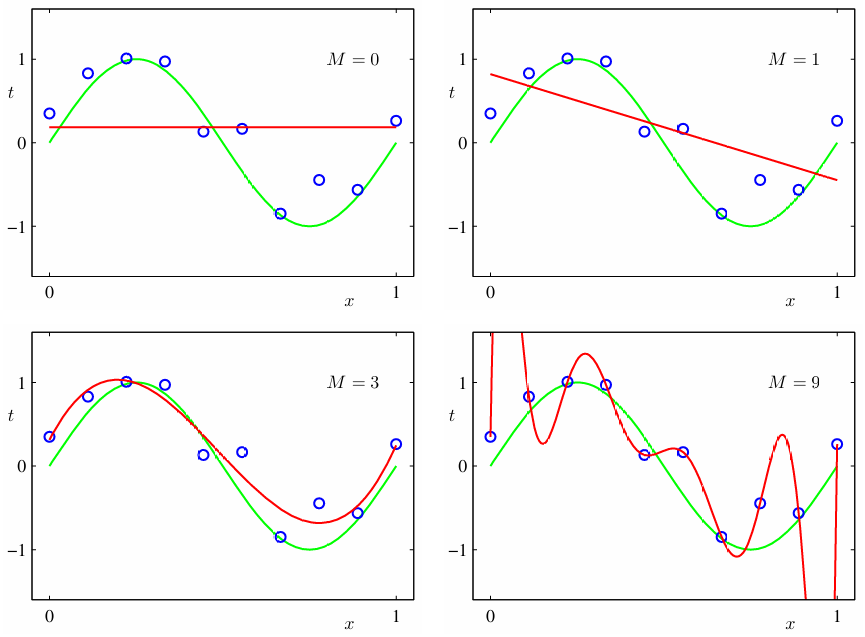
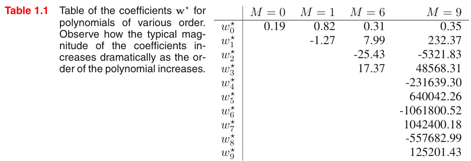

# Linear Regression

假設模型為 $y=ax+b$，那麼只要兩個不同的點，就可以決定此直線了。

例如 $(1,2),(4,7)$，那麼可以列出此聯立方程式：

$$
\begin{cases}
4a+b=7 \\
a+b=2
\end{cases}
$$
進一步寫成矩陣與向量的表示法：
$$
\begin{bmatrix}
4 & 1 \\
1 & 1
\end{bmatrix}
\begin{bmatrix}
a \\ b
\end{bmatrix}
=
\begin{bmatrix}
7 \\ 2
\end{bmatrix}
$$

$$
\mathbf{A}\vec{x}=\vec{b}
$$
$$
\vec{x}=\mathbf{A}^{-1}\vec{b}
$$

這邊可以用 [[Gaussian Elimination]], [[LU 分解]], LL 分解去解。

# LSE
那如果超過兩個點呢？如果去找最適合的直線呢？

假設我們有 $k$ 個資料點：$(x_1,y_1), (x_2,y_2), \dots, (x_k,y_k)$，而我們要找一條直線 $f(x)=ax+b$，使他能最能貼近這些點的趨勢，那麼要先定義誤差：

$$
e_i = y_i - f(x_i)= y_i - (a x_i + b)
$$
這裡定義的誤差意思為，你用真實的資料點 $y_i$ 去減掉你預測出來的結果 $f(x_i)$，那就是誤差。

接著我們把他們的平方加起來(用平方而非絕對值)，那麼所謂的 Loss，所謂的 Square error 則表示為：

$$
\text{LSE}=\sum_{i}{e_i}^{2}=\sum_i(y_i-f(x_i))^{2}
$$
那我們的目標就是找到參數組合 $a,b$ 使得誤差最小，那麼表示為：

$$
\arg\min_{a,b} \sum_i(y_i-f(x_i))^{2}
$$
我們先展開看看：
$$\text{LSE} = \sum_{i=1}^k (ax_i+b-y_i)^2$$
$$
=\begin{bmatrix} ax_1+b-y_1 & ax_2+b-y_2 & \cdots \end{bmatrix}
\begin{bmatrix} ax_1+b-y_1 \\ ax_2+b-y_2 \\ \cdots \end{bmatrix}
$$
$$= (\mathbf{A}\vec{x}-\vec{b})^{\top}(\mathbf{A}\vec{x}-\vec{b})$$

$$= ||\mathbf{A}\vec{x}-\vec{b}||^{2}$$
其中：
$$
\mathbf{A}\vec{x}-\vec{b}
=\begin{bmatrix} x_1 & 1 \\ x_2 & 1\\ \vdots & \vdots \\ x_k & 1\end{bmatrix}_{k \times 2}

\begin{bmatrix} a \\ b \end{bmatrix}_{2 \times 1}-

\begin{bmatrix} y_1 \\ y_2 \\ \vdots \\ y_k\end{bmatrix}_{k \times 1}
$$
$||\mathbf{A}\vec{x}-\vec{b}||^{2}$寫成內積：
$$
(\mathbf{A}\vec{x}-\vec{b})^{\top}_{1 \times k}(\mathbf{A}\vec{x}-\vec{b})_{k \times 1}
$$
$$
=(\vec{x}^{\top}\mathbf{A}^{\top}-\vec{b}^{\top})(\mathbf{A}\vec{x}-\vec{b})
$$
$$
=\vec{x}^{\top}\mathbf{A}^{\top}\mathbf{A}\vec{x}-\vec{x}^{\top}\mathbf{A}^{\top}\vec{b}-\vec{b}^{\top}\mathbf{A}\vec{x}+\vec{b}^{\top}\vec{b}
$$
又 $\vec{x}^{\top}\mathbf{A}^{\top}\vec{b}=\vec{b}^{\top}\mathbf{A}\vec{x}$，他們都是純量，取轉置結果不變，因此：
$$
=\vec{x}^{\top}\mathbf{A}^{\top}\mathbf{A}\vec{x}-2\vec{x}^{\top}\mathbf{A}^{\top}\vec{b}+\vec{b}^{\top}\vec{b}
$$

接著令上面的式子為 $L$，又 $\vec{x}=\begin{bmatrix} a \\ b \end{bmatrix}$，來取偏微分，需要留意有 $\vec{x}$ 的項：

$$
\frac{\partial L}{\partial  \vec{x} }=2\mathbf{A}^{\top}\mathbf{A}\vec{x}-2\mathbf{A}^{\top}\vec{b}=0
$$
那麼：
$$
\mathbf{A}^{\top}\mathbf{A}\vec{x}=\mathbf{A}^{\top}\vec{b}
$$
則：
$$
\vec{x}=(\mathbf{A}^{\top}\mathbf{A})^{-1}\mathbf{A}^{\top}\vec{b}
$$

需要留意的是 $\mathbf{A}^{\top}\mathbf{A}$ 是正半定矩陣(對稱)，不保證可逆。

事實上，這個概念也可用投影矩陣與正交投影去理解，我們得到了參數組合 $\vec{x}$，$\vec{b}$ 投影在 $\text{col}(\mathbf{A})$ 上形成了投影向量 $\vec{p}$(或者說是預測值 $\hat{y}$)，而因為 $\vec{p}=\mathbf{A}\vec{x}$，又 $\vec{x}=(\mathbf{A}^{\top}\mathbf{A})^{-1}\mathbf{A}^{\top}\vec{b}$，把 $\vec{x}$ 代回去，那麼得到：$\vec{p} = \mathbf{A}(\mathbf{A}^{\top}\mathbf{A})^{-1}\mathbf{A}^{\top}\vec{b}$，那前面這一大串作用在向量 $\vec{b}$ 的矩陣就是投影矩陣 $P$。

# Non-Linear Regression

可以將 $x_i$ 經過函式 $\phi(x)$ 後得到新的特徵。

例如可以取基底 $\phi=\{x^{0},x_1,x_2,\cdots \}$，參見[[基底與維度#筆記 標準基底]]

舉個例子，例如取基底為 $\{e^{x},\ln(x),x^{3}\}=\{\phi_1(x),\phi_2(x),\phi_3(x)\}$，那麼：
$$
y=\beta_0+\beta_1\phi_1(x)+\beta_2\phi_2(x)+\beta_3\phi_3(x)
$$

更一般化可以如此表示，$k$ 筆資料，基底大小為 $d$：
$$
\begin{bmatrix} 
1 & \phi_1(x_1)  & \cdots & \phi_d(x_1)\\
1 & \phi_1(x_2)  & \cdots & \phi_d(x_2)\\
\vdots & \vdots & \ddots & \vdots \\
1 & \phi_1(x_k) & \cdots & \phi_d(x_k)
\end{bmatrix}
\begin{bmatrix} \beta_0 \\ \beta_1 \\ \vdots \\\beta_d \end{bmatrix}
$$
$$
=\Phi\vec{\beta}
$$
其中 $\Phi$ 稱為設計矩陣。

# Overfitting

舉例來說用九次式去逼近，所有 10 個資料點都被模型的曲線給通過了，誤差為 $0$，每個參數取絕對值都很大，那是因為模型把噪點都學進去了，模型太複雜了。

# Regularization

控制模型的參數不要那麼大(取絕對值後)，那麼就把他們的值作為最小化的目標之一，因此：

$$
\arg \min_{\vec{x}} (||\mathbf{A}\vec{x}-\vec{b}||^2 + \lambda ||\vec{x}||^{2})
$$

也就是在 LSE 的基礎上，加上參數向量的長度作為「懲罰」，所謂的 L2-Norm，而調整 $\lambda$ 取決於你的設定。

那麼需要最佳化的式子為：
$$
J(\vec{x})=(\mathbf{A}\vec{x}-\vec{b})^{\top}(\mathbf{A}\vec{x}-\vec{b})+\lambda \vec{x}^{\top}\vec{x}
$$
展開整理，偷用之前 LSE 的結果：

$$J(\vec{x}) = \vec{x}^{\top}\mathbf{A}^{\top}\mathbf{A}\vec{x} - 2\vec{x}^{\top}\mathbf{A}^{\top}\vec{b} + \vec{b}^{\top}\vec{b} + \lambda\vec{x}^{\top}\vec{x}
$$
接著為了後續的微分，我們把 $\lambda\vec{x}^{\top}\vec{x}$ 改寫成 $\vec{x}^{\top}(\lambda \mathbf{I})\vec{x}$，以及把包含 $\vec{x}^{\top} \dots  \vec{x}$ 的項合併起來，整理成：

$$J(\vec{x}) = \vec{x}^{\top}(\mathbf{A}^{\top}\mathbf{A} + \lambda \mathbf{I})\vec{x} - 2\vec{x}^{\top}\mathbf{A}^{\top}\vec{b} + \vec{b}^{\top}\vec{b}
$$
接著，為了找到讓誤差最小的極值，我們對參數向量 $\vec{x}$ 取偏微分，並令其為 $0$：

$$\frac{\partial J}{\partial \vec{x}} = 2(\mathbf{A}^{\top}\mathbf{A} + \lambda I)\vec{x} - 2\mathbf{A}^{\top}\vec{b} = 0
$$

整理後得到：
$$
\vec{x}=(\mathbf{A}^{\top}\mathbf{A}+\lambda \mathbf{I})^{-1}\mathbf{A}^{\top}\vec{b}
$$
其中，$\lambda \gt 0$，保證 $(\mathbf{A}^{\top}\mathbf{A}+\lambda \mathbf{I})$ 是可逆的，又解決了參數的問題。

上述方法又稱為 Ridge Regularization，也就是 LSE + L2-Norm，若是用 L1-Norm，也就是 $\lambda||\vec{x}||_{1}$，那就是 Lasso，各有好處，因此也可以混和，例如：
$$
\text{LSE}+\lambda_1L_1+\lambda_2L_2+\cdots
$$

Lasso 有降低維度的可能(交界在某個維度的頂點)，Ridge 則讓參數權重變小。

參見[L1 , L2 Regularization 到底正則化了什麼 ? | Math.py](https://allen108108.github.io/blog/2019/10/22/L1%20,%20L2%20Regularization%20%E5%88%B0%E5%BA%95%E6%AD%A3%E5%89%87%E5%8C%96%E4%BA%86%E4%BB%80%E9%BA%BC%20_/)

